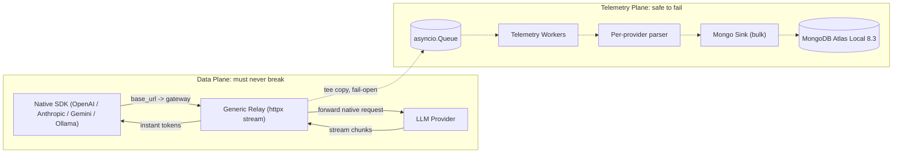
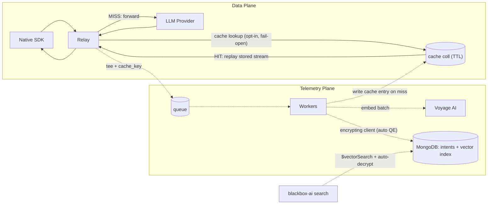

# ghosts-in-the-code

[](https://github.com/ranfysvalle02/ghosts-in-the-code/actions/workflows/ci.yml)
[](./SECURITY.md)

---

# Build Your Own AI Flight Recorder (on MongoDB)

> A hands-on **reference project**, not a product. It teaches you how to build a
> pass-through LLM gateway that records *what your AI did and the reasoning it
> gave* — and how a single MongoDB collapses the five systems you'd otherwise
> bolt together.

When an AI agent writes 15,000 lines overnight, it leaves no explanation. Three
weeks later a bug surfaces, you open the logs to ask *"why did it do that?"*, and
the logs say `200 OK`. The reasoning evaporated the instant the stream closed.
Every expensive, mysterious machine we build gets a flight recorder; AI agents
are the most expensive, most mysterious thing in your building, and they fly
blind.

This repo is a worked example of bolting a recorder onto them. You point your
existing SDK at a local gateway; it relays every byte faithfully to the provider
and back, and quietly keeps a queryable record on the side.

## What you'll learn

- **A fail-open, two-plane architecture** — a dumb, bulletproof *data plane* that
  can never be slowed or crashed by the *telemetry plane* that records off the
  hot path. This is a reusable systems pattern, written up in
  [docs/adr/0001-data-plane-telemetry-plane-split.md](docs/adr/0001-data-plane-telemetry-plane-split.md).
- **The document model for genuinely polymorphic data** — five providers, five
  wire dialects, one collection, zero migrations.
- **Semantic "time-travel" debugging** — `$vectorSearch` + hybrid `$rankFusion`
  retrieval over past interactions, in the same database that stores them.
- **Searchable encryption** — Queryable Encryption keeps prompts and source code
  encrypted client-side while vector search keeps working.
- **The honest epistemics of "intent."** A captured chain-of-thought is the
  model's *stated* rationale — self-reported, and sometimes unfaithful to what
  actually drove the output. We treat a capture as a **decision record** (inputs
  + actions taken + stated reasoning), not a confession. See
  [docs/intent-is-biased.md](docs/intent-is-biased.md).

## The curriculum

Work through [`steps/`](steps/) in order. Each step is a runnable snapshot that
builds toward the canonical implementation in [`src/blackbox_ai`](src/blackbox_ai):

1. [steps/01-pass-through-relay](steps/01-pass-through-relay) — the invisible dashcam: a fail-open streaming relay.
2. [steps/02-two-plane-capture](steps/02-two-plane-capture) — tee + queue + workers; the recorder that can't crash the plane.
3. [steps/03-parsers-and-intent](steps/03-parsers-and-intent) — per-provider parsers, the polymorphic Intent Document, and *why "intent" is biased*.
4. [steps/04-vector-time-travel](steps/04-vector-time-travel) — embeddings, `$vectorSearch`, and hybrid `$rankFusion`.
5. [steps/05-queryable-encryption](steps/05-queryable-encryption) — the safe with a search slot (fail-closed).
6. [steps/06-cache-and-replay](steps/06-cache-and-replay) — a self-cleaning TTL cache and portable replay artifacts.
7. [steps/07-production-hardening](steps/07-production-hardening) — secure-by-default, and the honest gap to real production.

## Reference architecture, not production

This is teaching code: complete, tested, and runnable, but deliberately scoped.
It is **not** a hardened product and ships with no SLA. To run something like it
in anger you would still need, at minimum:

- **P99 at scale** — the relay is inline on every call, so you own an
  *added-overhead* SLO, connection/backpressure tuning, and horizontal scale
  (the discipline: keep CPU work off the event loop).
- **Identity & access** — SSO/SAML, RBAC, and audit logs *of access to the logs*
  (decrypted prompts contain secrets and source).
- **Key management** — BYOK/CMEK via a managed KMS/HSM, not a local key.
- **Data governance** — PII/secret redaction, residency, and retention/erasure.
- **Multi-tenancy & HA** — orgs/teams/quotas, isolation, failover, zero-downtime.

These gaps are intentional, and they are themselves teaching content — Step 07
walks through them.

---

# Blackbox AI

[](https://github.com/ranfysvalle02/ghosts-in-the-code/actions/workflows/ci.yml)

This repository implements the recorder: a **native pass-through LLM gateway** built on FastAPI and MongoDB. It sits between your developers/agents and the frontier providers, streams every response back with **negligible added overhead** (capture is off the hot path), and records a rich, queryable **Intent Document** for every interaction - entirely out-of-band and fail-open.

Supported providers: **OpenAI, Azure OpenAI, Anthropic, Google Gemini, Ollama.**

## The core idea: two planes that cannot break each other

The architecture is deliberately split so the part that is allowed to fail can never take down the part that must not.



- **Data plane** - a single generic relay forwards the native request, injects sovereign credentials, and streams the response straight back. It never parses, never blocks on the database.
- **Telemetry plane** - a bounded queue drained by worker tasks parses a *copy* of the stream and bulk-writes Intent Documents to MongoDB. If MongoDB is down, the queue is full, or a parser hits a bug, the client's request still completes. Telemetry is best-effort and isolated.

Adding a provider is additive: one `ProviderConfig` entry in [src/blackbox_ai/providers/catalog.py](src/blackbox_ai/providers/catalog.py) plus one parser in [src/blackbox_ai/telemetry/parsers/](src/blackbox_ai/telemetry/parsers/).

## The two-line drop-in

Point your existing, unmodified SDK at the gateway. No code rewrite, no new SDK to learn.

```python
# OpenAI
from openai import OpenAI
client = OpenAI(base_url="http://localhost:8000/openai/v1", api_key="gateway-token")

# Anthropic
from anthropic import Anthropic
client = Anthropic(base_url="http://localhost:8000/anthropic", api_key="gateway-token")

# Google Gemini (google-genai)
from google import genai
from google.genai import types
client = genai.Client(api_key="gateway-token",
                      http_options=types.HttpOptions(base_url="http://localhost:8000/gemini"))

# Azure OpenAI
from openai import AzureOpenAI
client = AzureOpenAI(azure_endpoint="http://localhost:8000/azure",
                     api_key="gateway-token", api_version="2024-10-21")

# Ollama
import ollama
client = ollama.Client(host="http://localhost:8000/ollama")
```

If you configure a provider's real key in the gateway's environment, clients only ever need a gateway token and the sovereign key never leaves your infrastructure. If you leave it unset, the gateway transparently forwards whatever credential the client already sends (zero-config relay).

## Auto-injected context (no logging code required)

Send these optional headers and the gateway groups telemetry for you - no instrumentation in your app:

| Header | Field | Purpose |
| --- | --- | --- |
| `X-Project-ID` | `project_id` | Group telemetry by microservice / repository |
| `X-Agent-Session` | `session_id` | Tie one autonomous run together |
| `X-Developer-ID` | `developer_id` | Attribute cost / usage per engineer |
| `X-Request-ID` | `request_id` | Correlate a single hop (generated if absent) |

## Quickstart

The gateway is **secure-by-default**: Queryable Encryption is on, so it needs a
key (and a QE-capable MongoDB - the bundled Atlas Local image qualifies).

```bash
# 1. Mint a local encryption key into .env (QE is on by default)
make gen-key

# 2. Start the gateway + MongoDB Atlas Local 8.3, then bootstrap storage
make up                # docker compose up --build -d
make init              # encrypted collections, indexes, vector + text indexes

# 3. Drive every configured provider via its native SDK
export OPENAI_API_KEY=sk-...   # set whichever you have
make demo                      # uv run python examples/demo.py
```

Just kicking the tires on a plain MongoDB? Set `GATEWAY_ENCRYPTION_ENABLED=false`
in `.env` to skip QE. For production, set `GATEWAY_ENV=production` (enforces auth
and fails fast on an insecure config).

Health probes: `GET /healthz` (liveness) and `GET /readyz` (MongoDB + worker readiness, with live metrics).

## Configuration

Copy [.env.example](.env.example) to `.env`. Highlights:

| Variable | Default | Meaning |
| --- | --- | --- |
| `GATEWAY_ENV` | `dev` | `production` enforces auth + fails fast on an insecure config |
| `GATEWAY_MONGO_URI` | `mongodb://localhost:27017/?directConnection=true` | Where captured Intent Documents live |
| `GATEWAY_REQUIRE_AUTH` / `GATEWAY_TOKENS` | `false` / - | Enforce gateway tokens (always on in `production`) |
| `GATEWAY_RATE_LIMIT_ENABLED` / `_REQUESTS` / `_WINDOW_S` | `true` / `120` / `60` | Per-client sliding-window rate limit (429 + `Retry-After`) |
| `GATEWAY_ENCRYPTION_ENABLED` / `GATEWAY_ENCRYPTION_KEY` | `true` / - | Queryable Encryption (on by default, fail-closed without a key) |
| `GATEWAY_EMBEDDINGS_PROVIDER` / `VOYAGE_API_KEY` | `voyage` / - | Voyage AI embeddings for vector + hybrid search (active once a key is set) |
| `GATEWAY_VECTOR_INDEX_NAME` / `GATEWAY_SEARCH_INDEX_NAME` | `intent_vector_index` / `intent_text_index` | Atlas Vector + Search indexes backing hybrid `$rankFusion` |
| `OPENAI_API_KEY`, `ANTHROPIC_API_KEY`, `GEMINI_API_KEY`, `AZURE_OPENAI_API_KEY`/`AZURE_OPENAI_ENDPOINT`, `OLLAMA_BASE_URL` | - | Sovereign provider credentials / endpoints |
| `GATEWAY_MAX_REQUEST_BYTES` / `GATEWAY_MAX_CONCURRENT_REQUESTS` | `10 MiB` / `100` | Data-plane memory backpressure (413 on oversized bodies, 503 at the in-flight cap) |
| `GATEWAY_TELEMETRY_*` | see file | Queue size, worker count, batch size/interval, capture cap |

> Secrets (provider keys, `GATEWAY_TOKENS`, `GATEWAY_ADMIN_TOKEN`, `GATEWAY_ENCRYPTION_KEY`) are held as `SecretStr` and masked in logs/repr; gateway-token comparison is constant-time.

## Operations

- **Metrics**: `GET /metrics` exposes Prometheus exposition - request-path instruments (`blackbox_relay_requests_total`, request/TTFT latency histograms, the in-flight gauge, and rejections) plus live telemetry-plane counters and queue depth (`blackbox_telemetry_*`). It is open by default for scraping; set `GATEWAY_METRICS_PROTECTED=true` (with `GATEWAY_ADMIN_TOKEN` set) to require the admin token, or front it with network policy.
- **Backpressure**: each in-flight request can hold up to `GATEWAY_MAX_REQUEST_BYTES + GATEWAY_TELEMETRY_MAX_CAPTURE_BYTES` in memory, so `GATEWAY_MAX_CONCURRENT_REQUESTS` bounds worst-case data-plane memory. Excess requests fail fast with `503 service_overloaded` and a `Retry-After` header rather than queueing.
- **Auth in passthrough**: when no sovereign key is configured for a provider, the gateway authenticates only via the dedicated `x-gateway-token` header (stripped before forwarding), so a client's real upstream credential in `Authorization` is never consumed or leaked as the gateway secret.
- **Deployment profile**: `GATEWAY_ENV=production` makes the gateway secure-by-default - client auth is always enforced and startup runs a self-check that **fails fast** on an insecure config (e.g. missing `GATEWAY_TOKENS`) and warns on risky ones (QE or rate limiting off). `dev` stays permissive but logs a loud warning when the relay is open.
- **Rate limiting**: a per-client sliding-window limiter (keyed by gateway token, else client IP) blunts single-source abuse; over-limit callers get `429 rate_limit_exceeded` + `Retry-After` (counted as `blackbox_relay_rate_limited`).
- **Embedding resilience**: the Voyage embedder is fail-open per batch and fronted by a circuit breaker - after `GATEWAY_EMBEDDING_BREAKER_THRESHOLD` (5) consecutive batch failures it stops calling the provider for `GATEWAY_EMBEDDING_BREAKER_COOLDOWN_S` (30s), then half-opens a trial. Documents are still written during an outage, just without vectors (re-embed later); no telemetry is lost.
- **Security headers**: every response carries `X-Content-Type-Options: nosniff`, `X-Frame-Options: DENY`, and `Referrer-Policy: no-referrer` (added only when absent, so relayed upstream headers are preserved).
- **Hybrid search**: `POST /admin/search` (and `blackbox-ai search`) default to `mode: "hybrid"`, fusing `$vectorSearch` (semantic) with an Atlas `$search` full-text leg over plaintext metadata via `$rankFusion`. Under QE the free-text fields are ciphertext and can't be text-indexed, so the vector leg carries meaning while the text leg sharpens metadata matches; the call transparently falls back to vector-only if the cluster lacks `$rankFusion`.

### Scaling horizontally

The two abuse controls are **per-process by design**, which is the correct semantics for each:

- **Concurrency cap** (`GATEWAY_MAX_CONCURRENT_REQUESTS`) bounds *this process's* memory (each in-flight request holds the buffered body + capture). Memory is inherently per-replica, so a per-process cap is exactly right - set it from each pod's memory budget and let your orchestrator scale replicas.
- **Rate limiter** is per-replica defense-in-depth, not a global quota. For a true cross-replica limit, enforce it at the edge (ingress / API gateway), **or** implement the `RateLimiter` protocol ([src/blackbox_ai/security/rate_limit.py](src/blackbox_ai/security/rate_limit.py)) against a shared store (e.g. Redis) - the relay depends only on that seam, so it is a drop-in with zero relay changes.

### Extending

- **KMS**: swap the local key for a managed KMS by changing only `kms_providers` and the per-DEK `master_key` ([src/blackbox_ai/security/encryption.py](src/blackbox_ai/security/encryption.py)) - see [Production security](#production-security-swap-the-local-key-for-a-cloud-kms) for AWS / Azure / GCP / KMIP snippets.
- **Distributed rate limiting**: implement `RateLimiter` against a shared backend (above).
- **Tracing**: OTLP tracing is a clean future add at the relay/worker boundary (the `Relay.handle` span and the telemetry-pipeline `submit`). It is intentionally not bundled (a heavy dependency and instrumentation surface), but the seam is already there.

## The Intent Document

Every interaction becomes one polymorphic, indexable document - best read as a **decision record**: the inputs, the actions the model took (`tools_called`), and its *stated* reasoning (`chain_of_thought`, which is self-reported, not ground truth - see [docs/intent-is-biased.md](docs/intent-is-biased.md)). The request `raw_payload` is preserved verbatim for replay; normalised fields are lifted alongside it. Indexes: compound `(project_id, timestamp)`, single `session_id`, and a partial index on `developer_id`. The `embedding`, `embedding_model`, `cache_key`, and `served_from_cache` fields power the [Phase 4 capstone features](#capstone-features-vector-search-token-caching-queryable-encryption) below.

## Quality bar

- **Strict typing** - `mypy --strict` clean across the codebase.
- **No blind exceptions** - enforced by `ruff` (`BLE`); every failure path catches specific, typed exceptions.
- **Tested** - unit tests for streaming fidelity, fail-open behaviour (MongoDB down still returns 200), per-provider parsers, plus an integration test against a live `mongodb-atlas-local:8.3`.

```bash
make check       # ruff + mypy + unit tests
make test-int    # integration tests (set MONGO_TEST_URI)
```

> Driver note: this project uses **PyMongo's native async API** (`AsyncMongoClient`). The Motor driver reached end-of-life in 2026 and PyMongo async is its officially recommended replacement, so the plan's intent (a non-blocking async MongoDB driver) is honoured with the current best-practice driver.

## Project layout

```
src/blackbox_ai/
  main.py            # app factory + lifespan (Mongo, pipeline, HTTP client)
  bootstrap.py       # shared component construction for server + CLI
  cli.py             # serve / gen-key / init / search / export dispatcher
  config.py          # pydantic-settings configuration
  search.py          # vector + hybrid ($rankFusion) search (auto-decrypts under QE)
  replay.py          # export a captured interaction as a portable, re-runnable artifact
  providers/         # ProviderConfig, catalog, registry (one entry per backend)
  proxy/             # the generic fail-open relay + streaming tee (data plane)
  telemetry/         # capture buffer, queue/workers, parsers, embeddings, sink
  cache/             # canonical request keys + TTL-indexed cache store
  security/          # Queryable Encryption manager + per-client rate limiter
  metrics.py         # Prometheus instruments + telemetry-plane collector
  db/                # AsyncMongoClient + vector & full-text index setup
  middleware/        # sovereign metadata -> context, security headers, logs
  api/               # health, metrics, admin search, the catch-all relay route
examples/demo.py     # all five native SDKs pointed at the gateway
tests/               # unit + integration tests with recorded fixtures
```

---

# Capstone Features: Vector Search, Token Caching, Queryable Encryption

Phase 4 adds the three capabilities that turn the flight recorder into a
searchable, encrypted, self-hostable vault you own end to end. All three are
**opt-in** and **independently toggleable**; with them off the gateway behaves
exactly as above. Critically, the heavy work stays in the **telemetry plane** -
only the (optional) cache *lookup* touches the request path, and it is
time-bounded and fail-open.



## Self-host quickstart (encrypted mode)

The Docker image bakes in MongoDB's `crypt_shared` library, so turning on
encryption is a pure config flip. End to end:

```bash
cp .env.example .env

# 1. Generate a local 96-byte master key (appended to .env), then enable QE.
make gen-key
#    set GATEWAY_ENCRYPTION_ENABLED=true in .env
#    (optionally) set GATEWAY_EMBEDDINGS_PROVIDER=voyage + VOYAGE_API_KEY,
#                 GATEWAY_CACHE_ENABLED=true, GATEWAY_ADMIN_TOKEN=<token>

# 2. Bring up the gateway + MongoDB Atlas Local 8.3.
make up

# 3. Bootstrap encrypted collections, indexes, TTL, and the vector index.
make init

# 4. Time-travel through your agents' intent.
make search q="why did the agent change the connection pool limits?"
```

`make init` / `make search` run inside the gateway container (where `crypt_shared`
lives). You can also call the admin API directly:

```bash
curl -s http://localhost:8000/admin/search \
  -H "X-Admin-Token: $GATEWAY_ADMIN_TOKEN" \
  -H "content-type: application/json" \
  -d '{"query":"hesitation about database connection pooling","k":5,"project_id":"auth-service-migration"}'
```

## 1. Vector "time-travel" search

Each captured Intent Document is embedded (in a worker, off the hot path) with
**Voyage AI** `voyage-code-3` (1024-dim) - Voyage is a MongoDB company and the
model is tuned for code/agent reasoning. The embedded text prefers the model's
hidden **chain-of-thought**, then its visible **content**, then the user prompt.
An Atlas **`vectorSearch`** index over the `embedding` field (with `project_id`,
`session_id`, `provider`, `developer_id` as pre-filters) powers semantic recall:

> **A caveat worth internalizing.** Embedding the chain-of-thought makes your
> search index lean on the model's *stated* reasoning, which is self-reported and
> can be unfaithful (and varies in fidelity across providers). It is the
> convenient signal, not the trustworthy one. See
> [docs/intent-is-biased.md](docs/intent-is-biased.md) for why, and what to anchor
> on instead (the objective artifacts: tool calls, diffs, params).

> *"Find me all past generations where the assistant expressed hesitation about
> the security of our database connection pooling."*

- **Backend**: `GATEWAY_EMBEDDINGS_PROVIDER=voyage` + `VOYAGE_API_KEY`. Pluggable
  via the `Embedder` protocol - a local model can be added without touching the
  pipeline. With embeddings off, everything else still works.
- **Fail-open**: an embedding error simply writes the document without a vector
  (it is invisible to vector search until re-embedded), never losing telemetry.
- **Tuning**: `GATEWAY_EMBEDDING_DIMS` (256/512/1024/2048 for `voyage-code-3`)
  and `GATEWAY_VECTOR_INDEX_NAME`. The service requests `numCandidates =
  max(k*20, 100)`; raise it for higher recall at the cost of latency.

> **Atlas-native alternative.** If you prefer not to call an external embedding
> API, MongoDB Atlas can auto-embed via an **Atlas Vector Search auto-embedding**
> index (server-side embedding on `voyage-code-3`). To use it, leave
> `GATEWAY_EMBEDDINGS_PROVIDER=none`, store the raw text, and define the index
> with an auto-embedding `text` field instead of a `vector` field. This gateway
> ships the client-side path by default because it keeps the deployment fully
> self-contained and provider-agnostic.

## 2. Token caching (exact-match, opt-in)

A normalized hash of `provider + method + path + body` (minus the `stream` flag)
keys an exact-match cache backed by a TTL-indexed collection.

- **Opt-in** per request via `X-Intent-Cache: on`, or flip
  `GATEWAY_CACHE_DEFAULT_ON=true` to cache every eligible request. Only JSON-body
  `POST`s (the shape of every generation call) are cacheable.
- **Format-safe**: the entry's identity is `(cache_key, streamed)`, so an SSE
  response is never replayed to a client expecting a single JSON document, or
  vice versa.
- **Fail-open and off the hot path**: the lookup is bounded by
  `GATEWAY_CACHE_LOOKUP_TIMEOUT_S` (default 250ms) and any error/timeout falls
  through to upstream. The cache *write* happens in a worker. Responses carry
  `X-Intent-Cache: HIT|MISS`, and a HIT is still recorded as telemetry with
  `served_from_cache: true`.
- **Tuning**: `GATEWAY_CACHE_TTL_S`, `GATEWAY_CACHE_COLLECTION`.

## 3. Queryable Encryption (client-side)

With `GATEWAY_ENCRYPTION_ENABLED=true`, the crown-jewel fields are encrypted
**client-side, before they reach MongoDB**, via automatic Queryable Encryption:

| Collection | Encrypted (random, unqueryable) | Stays plaintext (queryable) |
| --- | --- | --- |
| `intents` | `raw_payload`, `intent_telemetry.content`, `intent_telemetry.chain_of_thought` | routing metadata, `performance`, `embedding` |
| `cache` | `response_body`, `request_payload` | `cache_key`, `streamed`, `expires_at` |

- **Local KMS for self-hosting**: one base64 96-byte master key
  (`GATEWAY_ENCRYPTION_KEY`, via `make gen-key`) wraps the per-field Data
  Encryption Keys. The Docker image bakes in `crypt_shared` and sets
  `GATEWAY_CRYPT_SHARED_LIB_PATH`.
- **Fail-closed**: if encryption is enabled but the key is invalid/missing or
  `crypt_shared` is absent, the gateway **refuses to start** rather than silently
  writing plaintext.
- **Vector search still works**: the `embedding` field stays in plaintext, so
  `$vectorSearch` operates on the encrypted `intents` collection and returns the
  matching documents with their text **decrypted client-side** - searchable
  encryption in practice. *(Verified against `mongodb-atlas-local:8.3`.)*

### Production security: swap the local key for a cloud KMS

The local key is ideal for development and self-hosting. For production, point the
encryption manager at a managed KMS - the only change is `kms_providers` and the
per-DEK `master_key` ([src/blackbox_ai/security/encryption.py](src/blackbox_ai/security/encryption.py)):

```python
# AWS KMS
kms_providers = {"aws": {"accessKeyId": "...", "secretAccessKey": "..."}}
master_key = {"region": "us-east-1", "key": "arn:aws:kms:us-east-1:...:key/..."}

# Azure Key Vault
kms_providers = {"azure": {"tenantId": "...", "clientId": "...", "clientSecret": "..."}}
master_key = {"keyVaultEndpoint": "myvault.vault.azure.net", "keyName": "blackbox-ai"}

# GCP KMS
kms_providers = {"gcp": {"email": "...", "privateKey": "..."}}
master_key = {"projectId": "...", "location": "global",
              "keyRing": "blackbox-ai", "keyName": "master"}

# KMIP (e.g. HashiCorp Vault, Fortanix)
kms_providers = {"kmip": {"endpoint": "kmip.example.com:5696"}}
master_key = {"keyId": "1"}
```

Everything else - encrypted collections, DEK bootstrap, the encrypting client -
stays identical; only the KMS provider and master key change.

## 4. Portable replay artifacts

Capturing intent is only half the value - you also want to **own and replay** it.
Every interaction is exportable as a self-contained, re-runnable artifact: the
exact provider, path, and verbatim (decrypted) request body.

```bash
blackbox-ai export <request_id>             # the verbatim request body (decrypted)
blackbox-ai export <request_id> --as curl   # a ready-to-run request against the gateway
```

Or over the admin API (guarded by `GATEWAY_ADMIN_TOKEN`):

```bash
curl -s http://localhost:8000/admin/intents/<request_id>/replay \
  -H "X-Admin-Token: $GATEWAY_ADMIN_TOKEN"
```

- **Export, not auto-replay**: the gateway hands you the artifact and never
  re-issues it - a captured agent request can carry destructive tool calls
  (`edit_file`, `delete`), so re-running one is always a deliberate human action.
  The data plane stays a witness that touches nothing.
- **Two honest tiers of replay**: feeding the verbatim payload to a cheaper /
  newer / open-source model reproduces the *inputs* exactly (the *output* is a
  fresh generation - the lock-in escape hatch). The only byte-for-byte
  deterministic replay is the exact-match response [cache](#2-token-caching-exact-match-opt-in).
- **Read-only & decrypt-on-read**: `export` reads through the encrypting client,
  so `raw_payload` comes back as plaintext while staying ciphertext at rest. The
  original query string is not captured, so providers that carry parameters in
  the URL (e.g. Gemini's `alt=sse`) may need it re-added.

## Phase 4 configuration

| Variable | Default | Meaning |
| --- | --- | --- |
| `GATEWAY_ENCRYPTION_ENABLED` | `true` | Client-side Queryable Encryption (on by default, fail-closed) |
| `GATEWAY_ENCRYPTION_KEY` | - | Base64 96-byte local master key (`make gen-key`) |
| `GATEWAY_CRYPT_SHARED_LIB_PATH` | (baked in image) | Path to MongoDB `crypt_shared` for non-Docker runs |
| `GATEWAY_EMBEDDINGS_PROVIDER` | `voyage` | `none` or `voyage` |
| `VOYAGE_API_KEY` | - | Voyage AI key (required for `voyage`) |
| `GATEWAY_EMBEDDING_MODEL` / `_DIMS` | `voyage-code-3` / `1024` | Embedding model and dimensionality |
| `GATEWAY_EMBEDDING_BREAKER_THRESHOLD` / `_COOLDOWN_S` | `5` / `30` | Circuit breaker around the embedder (consecutive failures / cooldown) |
| `GATEWAY_VECTOR_INDEX_NAME` | `intent_vector_index` | Atlas vector index name |
| `GATEWAY_CACHE_ENABLED` / `_DEFAULT_ON` | `false` / `false` | Enable caching / cache without per-request opt-in |
| `GATEWAY_CACHE_TTL_S` / `_LOOKUP_TIMEOUT_S` | `3600` / `0.25` | Entry lifetime / request-path lookup budget |
| `GATEWAY_ADMIN_TOKEN` | - | Required to expose `POST /admin/search` |
| `GATEWAY_METRICS_PROTECTED` | `false` | Require the admin token on `GET /metrics` |

Integration tests for these features (QE round-trip, vector recall, TTL cache)
live in [tests/integration/test_phase4.py](tests/integration/test_phase4.py) and
skip cleanly when their prerequisites (atlas-local / `crypt_shared`) are absent.

